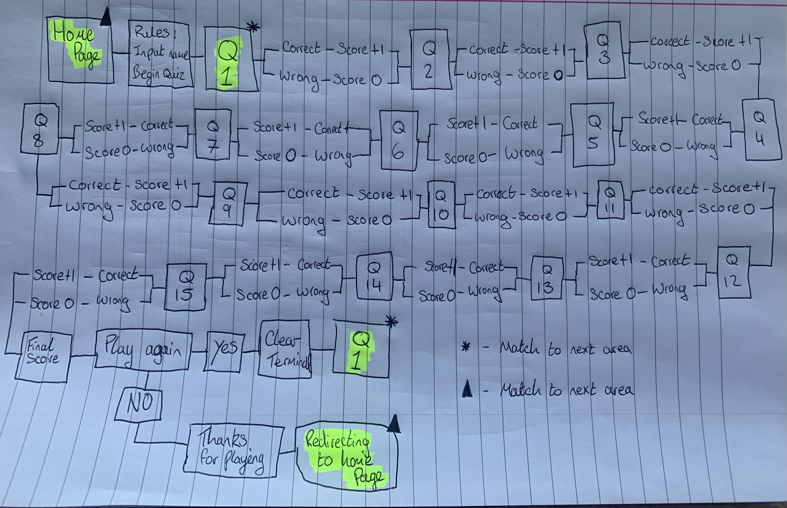
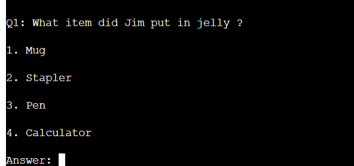
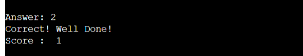
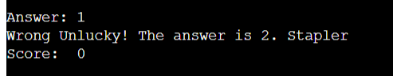
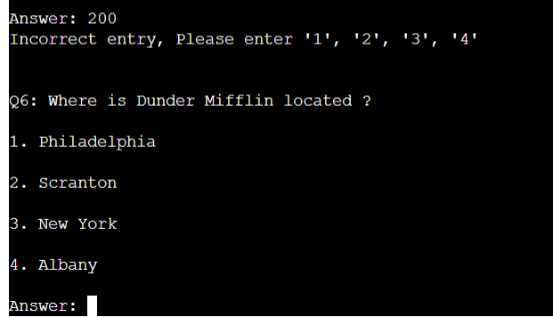
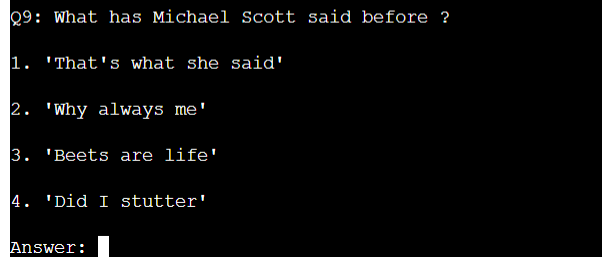
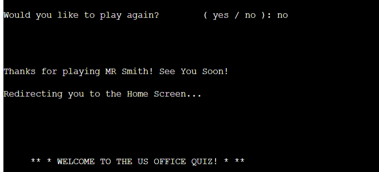

# **The US Office Quiz**

**The US Office Quiz** is a command-line quiz game based on the hit US tv show The office! This quiz has 15 questions with 15 points available all related to the show itself, the place its set and the characters.

[Link to live project](https://the-us-office-quiz-bd87dc50aa4a.herokuapp.com/)

## Project

The aim of this project is to:

- Test users knowledge of this brilliant tv series.
- Provide factual and accurate information to be understood in an interactive way. 
- To provide clear, visable and easy instructions with each visit.
- To keep a score tally to incentivise users to return to play again.
- To have user pass the quiz on to test between there friends.

## User goals:

- Get clear instructions on how to use the system in front of them that they can refer to if needed.
- The ability to input their name to make it more personal each time.
- To have fun in a clear and understanding way.

## Site owner goals

- Provide a program that is easy to use and maintain.
- Present a program that gives clear instructions each time a user visits.
- Develop a program that can have additional features added at a later date.
- Provide a program that has accurate and factual information for the user.

## Pre development

- I had writen out and created a flow chart. All I had to do then is follow the chart and code one area at a time before moving on to the next. The aim is to provide early and continuous delivery of the project.

## What you see first:

- The game will display the home page with the title "The US Office Quiz" with a welcome message, a small description of the amazing show,
the main reason I personally decided to choose "The office", the rules and regulations and a good luck message before you begin.
- The begining of the game will read out slowly bit by bit to make it more user friendly and understandable so its not just a big block of text.

- Once you have put your name into the terminal and pressed enter it will take you to the first question. This will be spaced out for easy reading. As it states in the rules you must answer with ether '1', '2', '3', '4' and '5' *for 1 question*.

- If answered correctly you will be shown a well done message along with the answer you put in, and your score tally will go up by one.

- If answered incorrectly you will be shown a Wrong Unlucky! message along with the correct answer, and your score tally will stay the same.

- If an entry into the terminal is not one of the 4/5 numbers as required, then you will be given an Incorrect Entry message, and the question will then repeat into the terminal in a loop until the correct entry is given.

-  The game will continue with the next question until you have completed all fifteen questions and a final score is given at the end of the fifteenth question.

- After the quiz is complete the user will be asked if they want to play again. They can only choose either yes or no. Yes and the game will clear the terminal and will go back to question one with the score reset. 

- If no is typed in then the game will go back to the Home screen with a personalised thank you for playing message. Then a Redirecting message will follow on from that and you will return to the home screen. If the user types anything else other than yes/no it will repeat until the correct entry is entered.

## Features:

- **Interactive Game** The game offers an interactive gaming experience, allowing the user to choose an answer with a response received straight back. 

- **Mulitple Choice Questions** The user is presented with 15 multiple choice questions about The US Office. Each question tests the users knowledge on the Tv series. 

- **Informative** If the user gets a question wrong, the game will inform the user they have got it wrong and provides the user with the correct answer. 

- **Score** The users score is tracked throughout the game and increases for each correct answer. 

- **Play Again Feature** Once the player answers all fifteen questions they are given the option of playing again, yes / no.

## Testing:

- I have manaully tested the project using [pep8]{https://pep8ci.herokuapp.com/} with no errors showing. 

![pep8(assets//pep8.png)

- I have used bothe my local termianl and the Heroku website to run the quiz with no errors shwing up.

## Deployment:

This project was deployed using Heroku. 
- steps for deployment:
    - Create a new Heroku app
    - Set the builds to Python and NodeJS in that order
    - Link the Heroku app to my repository
    - Click Deploy

## Credits:

- The Code Institute Love-Sandwiches Project help me learn a lot about Python. 

- The (www.w3schools.com) website helped with trying to figure out how to use the correct code and how to get it to work for me. 

- Slack chats - When I was really struggling I was able to ask other students for help. 
