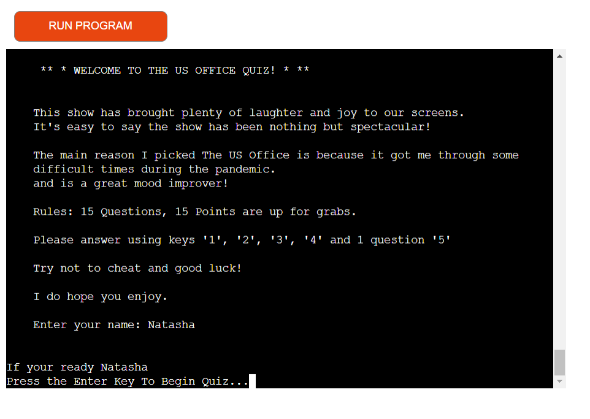

# **The US Office Quiz**

**The US Office Quiz** is a command-line quiz game based on the hit US tv show The office! This quiz has 15 questions with 15 points available all related to the show itself, the place its set and the characters.

[Link to live project](https://the-us-office-quiz-bd87dc50aa4a.herokuapp.com/)

## Project

The aim of this project is to:

- Test players knowledge of this brilliant tv series.
- Provide factual and accurate information to be understood in an interactive way. 
- To provide clear, visable and easy instructions with each visit.
- To have players pass the quiz on to test between there friends. 

## What you see first:

- The game will display the home page with the title "The US Office Quiz" with a welcome message, a small description of the amazing show,
the main reason I personally decided to choose "The office", the rules and regulations and a good luck message before you begin.

